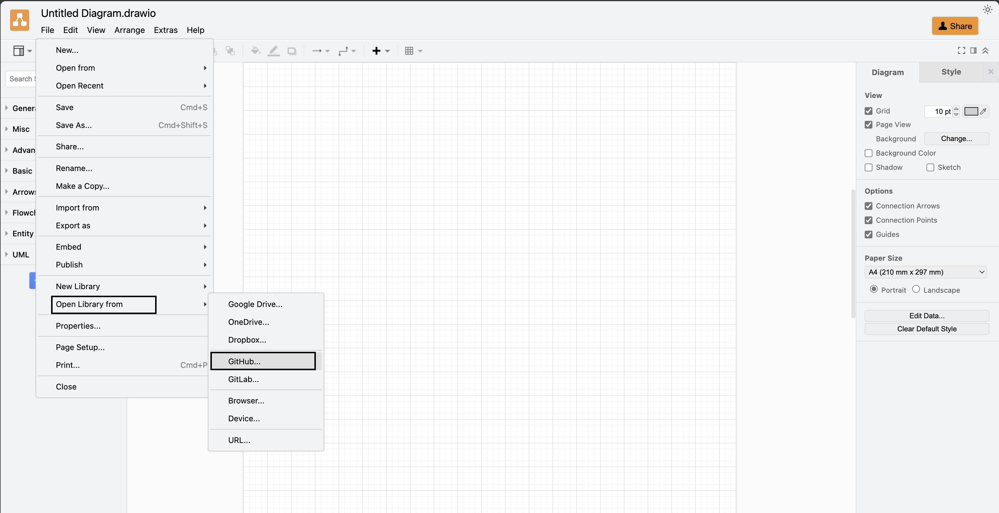
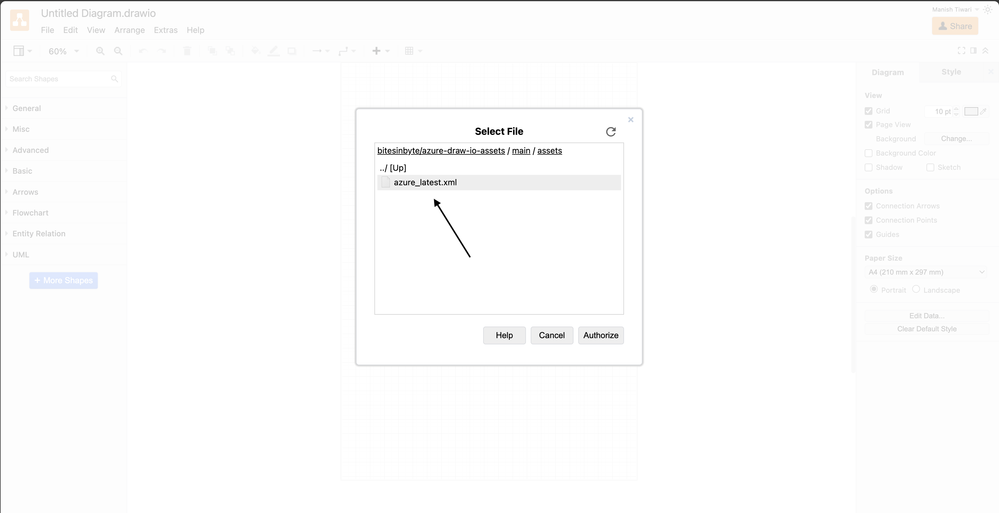
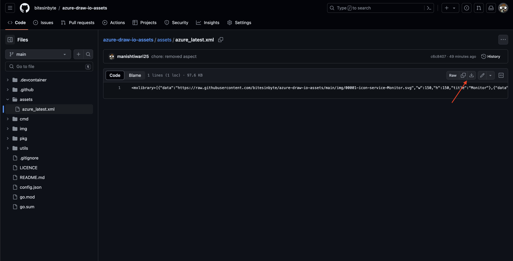
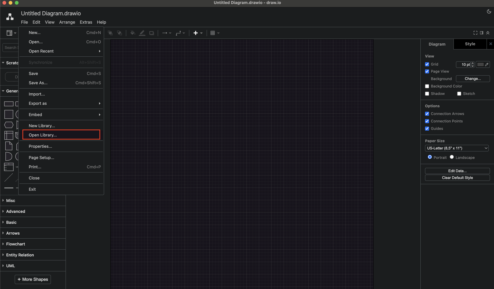

  

<h1 align="center">Azure Draw.io Assets</h1>

A collection of the latest assets for Microsoft Azure, optimized for use with Draw.io diagrams. Stay up-to-date with the newest Azure icons and symbols for your architectural diagrams and visualizations. You will always get the latest assets in this repository.

## Usage online

### By using he direct import link

The easiest way to consume one of these libraries, is to load them directly via the url parameter '[libs](https://desk.draw.io/support/solutions/articles/16000042546-supported-url-parameters)'. List the library urls as a semi-colon separated string. (example: https://app.diagrams.net/?splash=0&clibs=Uhttps://github.com/bitesinbyte/azure-draw-io-assets/blob/main/assets/azure_latest.xml)

### By using the asset link

1. Select "Open Library/Github" from "File" menu
   
2. Enter repository name "bitesinbyte/azure-draw-io-assets"
   
3. Select library file from main branch / assets
   

## Usage offline

1. Download the Asset file from [here](https://github.com/bitesinbyte/azure-draw-io-assets/blob/main/assets/azure_latest.xml)
   
2. On Desktop App, Go to file and select "Open Library"
   
3. Upload the downloaded asset.

## Need Help?

If you need any help or if you find any issue, please raise it [here](https://github.com/bitesinbyte/azure-draw-io-assets/discussions).

## License

Licensed under the [MIT license](https://github.com/bitesinbyte/azure-draw-io-assets/blob/main/LICENSE).
